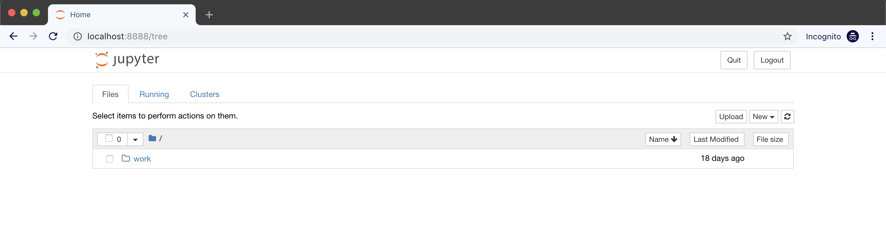
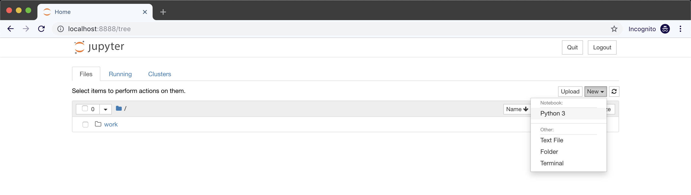
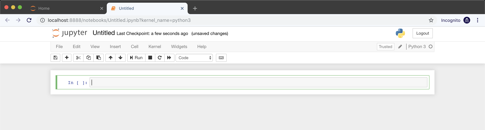

Analyzing Results
=================

.. note:: The following instructions are for analyzers with output type ``json``. See :doc:`../api/manifest` to learn more about this and other output types.

When you run an analyzer on the r2c platform we store the results in a group or team specific PostgreSQL database. There are a few ways we prefer to interact with results that all ultimately rely on a SQL client. The most common tools we've used and seen are:

1. `psql <https://www.postgresql.org/docs/9.3/app-psql.html>`_, for raw querying
2. `Jupyter Notebook <https://jupyter.org/>`_ with Python `sqlalchemy <https://www.sqlalchemy.org/>`_, for more in-depth analysis.

We'll use both in this tutorial to explore the available tables, data, and to find minified files.

Using ``psql``
--------------

First, install ``psql`` on your terminal.

.. code-block:: console

  # Mac OSX
  $ brew install postgresql

  # Ubuntu
  $ apt install psql

After installation, confirm it's available on your path.

.. code-block:: console

  $ psql

  psql: could not connect to server: No such file or directory
	Is the server running locally and accepting
	connections on Unix domain socket "/tmp/.s.PGSQL.5432"?

Next, log in to your group or team's database, setting ``$DB_PASSWORD`` and ``$GROUP`` (contact us if you don't know these values).

.. code-block:: console

  $ export $DB_PASSWORD=[YOUR-DB-PASSWORD]
  $ export $GROUP=[YOUR-GROUP]
  $ psql postgresql://notebook_user:$DB_PASSWORD@$GROUP-db.massive.ret2.co/postgres

  psql (10.6 (Ubuntu 10.6-0ubuntu0.18.04.1), server 9.6.8)
  SSL connection (protocol: TLSv1.2, cipher: ECDHE-RSA-AES256-GCM-SHA384, bits: 256, compression: off)
  Type "help" for help.
  
  postgres=>

To see `all` results:

.. code-block:: console

  postgres=> SELECT * FROM result;

At this stage you should see results! If you do not, confirm that you've run an analyzer and that it has reported success within the web UI.

Now that we've selected all results (``select *``), we'll limit the search with a more complicated query to just the results relevant to your analyzer, the selected version, and the corpus you ran against.

Replace ``$CORPUS_NAME``, ``$ANALYZER_NAME``, ``$ANALYZER_VERSION`` (e.g. ``npm-1000-2019-01-01``, ``r2c/minifinder``, ``0.1.0``):

.. code-block:: console

  postgres=> SELECT result.commit_hash 
  FROM  result, 
        commit_corpus 
  WHERE corpus_name = $CORPUS_NAME
        AND analyzer_name = $ANALYZER_NAME 
        AND analyzer_version = $ANALYZER_VERSION
        AND commit_corpus.commit_hash = result.commit_hash 
  GROUP BY result.commit_hash;

To learn more about available columns and tables, see the :doc:`../api/schemas` documentation.

[Optional] Using Jupyter Notebook with Python
---------------------------------------------

SQL queries by themselves won't always be enough for data analysis, so we'll use `Jupyter Notebook <https://jupyter.org/>`_ to crunch the numbers and identify minified files.

Run a Jupyter Notebook instance locally with docker [#jupyter-tut]_:

.. code-block:: console

  $ docker run -p 8888:8888 jupyter/scipy-notebook:latest
  Unable to find image 'jupyter/scipy-notebook:latest' locally
  latest: Pulling from jupyter/scipy-notebook
  a48c500ed24e: Already exists
  ...
  b1ae2d961bf6: Download complete
  Digest: sha256:3abebd0ed8ba4f6c6c3c92c0294ce3f0379e4db363c621411af6f9efcb7d97e8
  Status: Downloaded newer image for jupyter/scipy-notebook:latest
  Executing the command: jupyter notebook
  [I 04:01:37.656 NotebookApp] Writing notebook server cookie secret to /home/jovyan/.local/share/jupyter/runtime/  notebook_cookie_secret
  [I 04:01:38.835 NotebookApp] JupyterLab extension loaded from /opt/conda/lib/python3.7/site-packages/jupyterlab
  [I 04:01:38.836 NotebookApp] JupyterLab application directory is /opt/conda/share/jupyter/lab
  [I 04:01:38.838 NotebookApp] Serving notebooks from local directory: /home/jovyan
  [I 04:01:38.838 NotebookApp] The Jupyter Notebook is running at:
  [I 04:01:38.838 NotebookApp] http://(5d73df7e3877 or 127.0.0.1):8888/?token=<TOKEN>
  [I 04:01:38.838 NotebookApp] Use Control-C to stop this server and shut down all kernels (twice to skip confirmation).
  
Next, open Jupyter in your browser (see the instructions printed to your terminal from the running container).

We need a place to write our data analysis Python code. To do so, create a new notebook by clicking ``New`` in the upper right hand corner of the file tree pane.

In our new notebook we'll first establish a database connection, then use the same SQL commands as earlier, and finish by writing our data to a `Pandas dataframe <https://pandas.pydata.org/pandas-docs/stable/reference/api/pandas.DataFrame.html>`_ that can be manipulated, filtered, and edited.

Copy the following into your notebook and update the string constants for your specific environment (e.g. ``GROUP``):

.. literalinclude:: samples/jupyter-sample.py
    :linenos:
    :language: python

With this copied, we're ready to run the code!

.. [#jupyter-tut] `Jupyter Docker Stacks, Running a Container <https://jupyter-docker-stacks.readthedocs.io/en/latest/using/running.html#running-a-container>`_