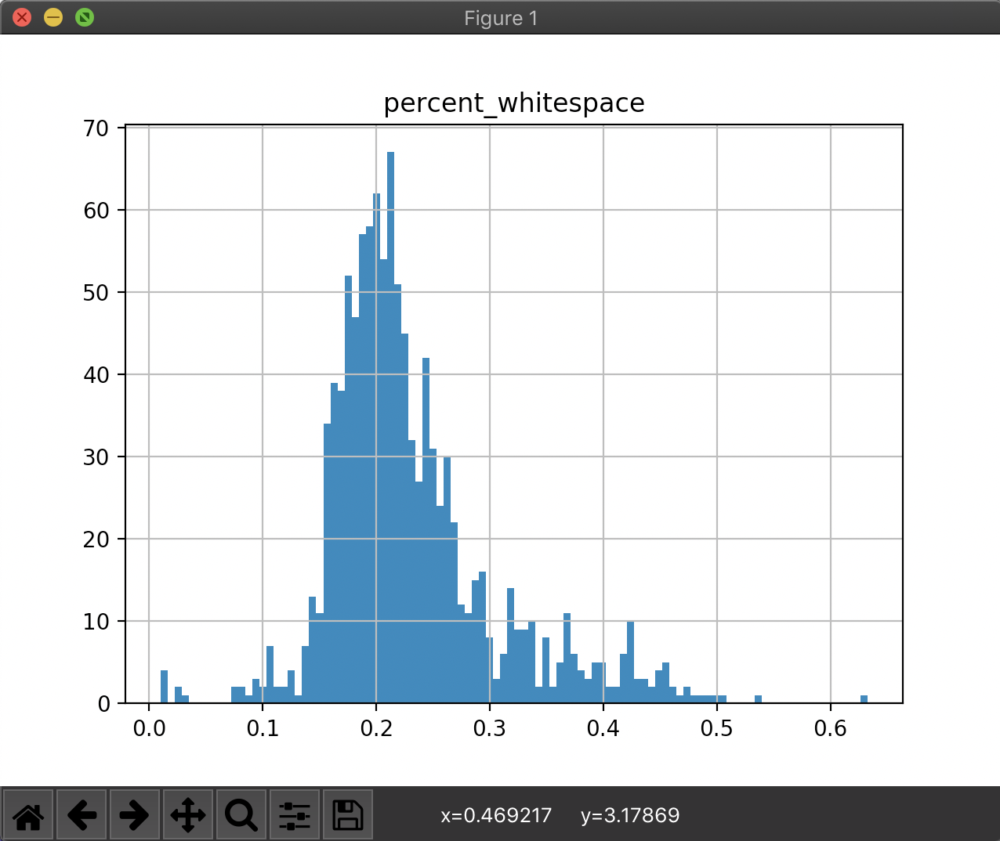

Analyzing Results
=================

.. note:: The following instructions are for analyzers with output type ``json``. See :doc:`../api/manifest` to learn more about this and other output types.

Now that your analyzer has been run in the web UI (and completed successfully, we hope!) we'll write some Python to load and graph the results.

When you run an analyzer on the r2c platform we store the results in a group or team specific PostgreSQL database. To interact with this database, we'll use a mix of `sqlalchemy <https://www.sqlalchemy.org/>`_, `psycopg2 <http://initd.org/psycopg/>`_, `pandas <https://pandas.pydata.org/>`_, and `matplotlib <https://matplotlib.org/>`_ Python libraries. Let's install these in your local environment:

.. code-block:: console

  $ pip3 install sqlalchemy psycopg2-binary pandas matplotlib

Next, create a file in a scratch directory called ``minifinder-results.py``:

.. code-block:: console

  $ touch minifinder-results.py

Copy the following code into ``minifinder-results.py`` and update the constants with your group's or tenant's information:

.. literalinclude:: samples/jupyter-sample.py
    :linenos:
    :language: python

Finally, run ``minifinder-results.py``, which will produce a graph of results:

.. code-block:: console

  $ python3 minifinder-results.py

Success! You've gone from a question, "how much of each file in a project is whitespace", to analyzing 1000 npm projects, to graphing the results!

Next up is writing your own analyzer, interrogating your data, and making the JavaScript ecosystem a better place. If you have any questions or concerns, please don't hesitate to reach out to us at :email:`hello@retuntocorp.com`.