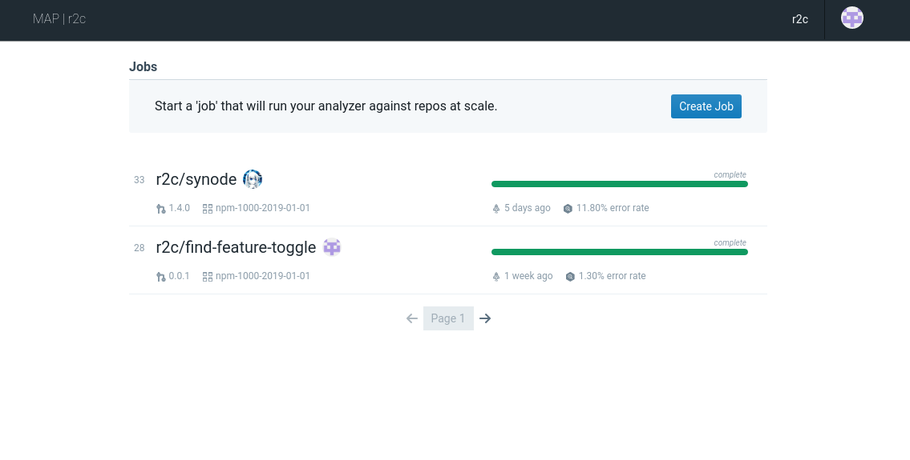
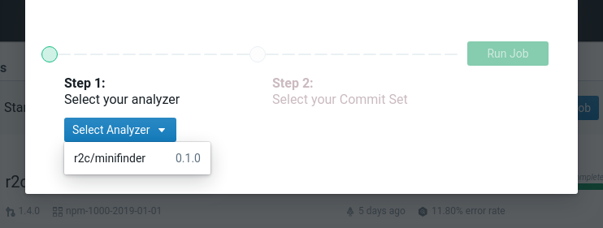
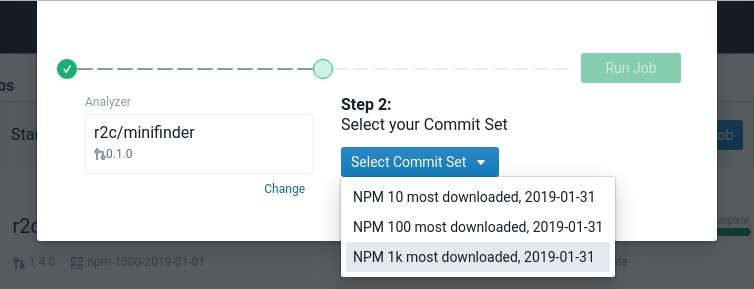

Running on r2c
==============

Pushing to r2c
--------------

Before we can run analysis at scale, we need to upload the analyzer to ``r2c``.

Uploading an analyzer is simple. In :doc:`creating`, we logged in to the r2c system, so we already
have our credentials to push analyzers to r2c. Once published, though, analyzer versions can't be
unpublished, so we should take a quick look at our analyzer to make sure everything is ready to
go. For larger analyzers, this would be the time to also run all of our unit tests and integration
test. For this tutorial analyzer, we'll just sanity-check the fields in ``analyzer.json``:

.. literalinclude:: samples/minifinder/analyzer.json
    :linenos:
    :language: json
   
Everything looks mostly good. However, to follow best practices, our analyzer should use `Semantic
Versioning`_. As this is our first release, but we're not yet sure if everything is production
ready, we should designate this release version ``0.1.0``:

.. code-block:: json

  "version": "0.1.0",

.. _Semantic Versioning: https://semver.org/

.. highlight:: text

Great! Now we're all set. We can push our analyzer to r2c by running the following command from
within the analyzer directory:

.. code-block:: console

  $ r2c push

That's it! Now let's head on over to :samp:`https://[YOUR-GROUP].massive.ret2.co/` to run your analyzer on 1000 npm projects and dive right into the results.

Starting the Job
----------------

Once you've logged in with GitHub you'll be taken to your group's Jobs page, which will look similar to this:

Click the "Create Job" button, which will pull up a menu letting you select the analyzer you've just
pushed!

Now we'll select a corpus to run our analyzer on: ``NPM 1k most downloaded, 2019-01-31``. This corpus has the 1000 most downlaoded npm packages on January 31st, 2019.

Click "Run Job" to start the analysis! Your job will be added to the jobs list, where you can click on it to see output, console logs, and errors coming in in real time!

See :doc:`results` for next steps.
      
.. note:: When a job is first kicked off, your infrastructure may need to "warm up"; idle machines will start processing your job and new machines will be brought online to handle the demand. Once warmed up a job should proceed quickly and you'll get results within just a few minutes for quick analyzers like minifinder.
